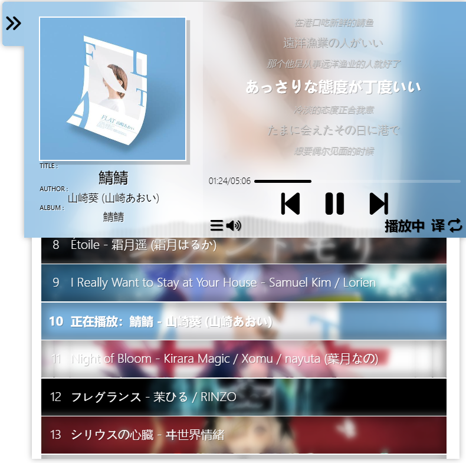

# htmlMusicPlayer

为您的网页侧面增加一个在线音乐播放器。

## 项目功能

- 基本的音乐播放功能
- 较为美观的页面
- 歌词展示功能
- 歌词中文翻译功能
- 炫酷的动态音乐列表

## 技术栈

- JavaScript
- PHP
- CSS
- HTML
- SQL
- FontAwesome 6

## 安装步骤

1. 在`<head>`中增加`<link rel="stylesheet" href="https://cdnjs.cloudflare.com/ajax/libs/font-awesome/6.0.0-beta3/css/all.min.css"/>`
2. 在网站末尾增加``
3. 将 `database.sql` 文件中的 SQL 语句导入到您的数据库中，确保您的数据库文件已备份，避免造成损失。
4. 复制`getMusicInfo.php`。
5. 复制并修改`databaseConnetConfig.php`为您的数据库登陆数据。
6. 创建三个文件夹`cover``lrc``music`。
7. `cover`文件夹下jpg格式音乐封面，格式为`id.jpg`。`lrc`文件夹下存放lrc歌词文件，文件名称为`id-language.lrc`，`language`仅支持`cn`，`jp`，`en`，`ru`四种语言。`music`文件夹下存放音乐文件，格式为`id-format`。

## 数据库

1. `id`:从0开始递增，对应`cover`,`lrc`,`music`文件夹中的`id`
2. `title`:音乐标题
3. `author`:作者
4. `album`:专辑
5. `format`:音乐文件格式
6. `duration`:音乐时长
7. `chorusIn`:副歌开始(秒)
8. `chorusOut`:副歌结束(秒)
9. `BPM`:音乐BPM（暂无应用，可不填）
10. `language`:音乐主要语言，仅支持`cn`，`jp`，`en`，`ru`四种语言
11. `isTranslate`:是否有中文翻译，1为有，0为没有
12. `bgPositionY`:音乐列表中背景位置的-Y值，将封面中的重点元素对齐到背景上
13. `mainColor`:主色调

## 预览

## 联系方式
如果有任何问题或建议，请联系 sfout@qq.com。

